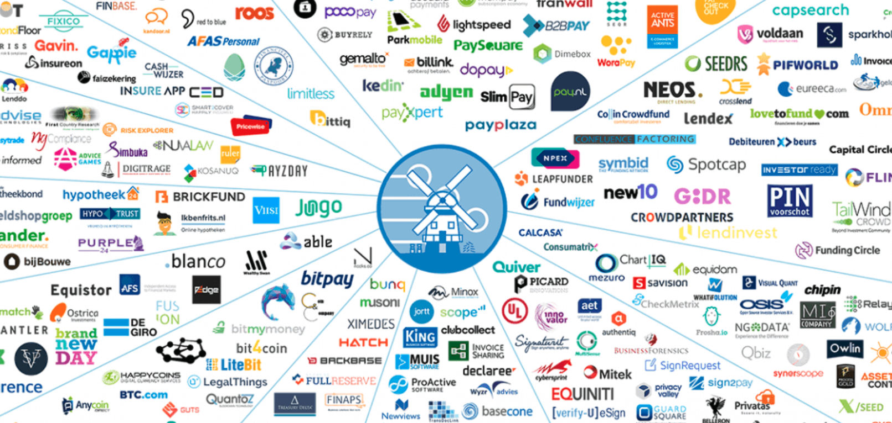
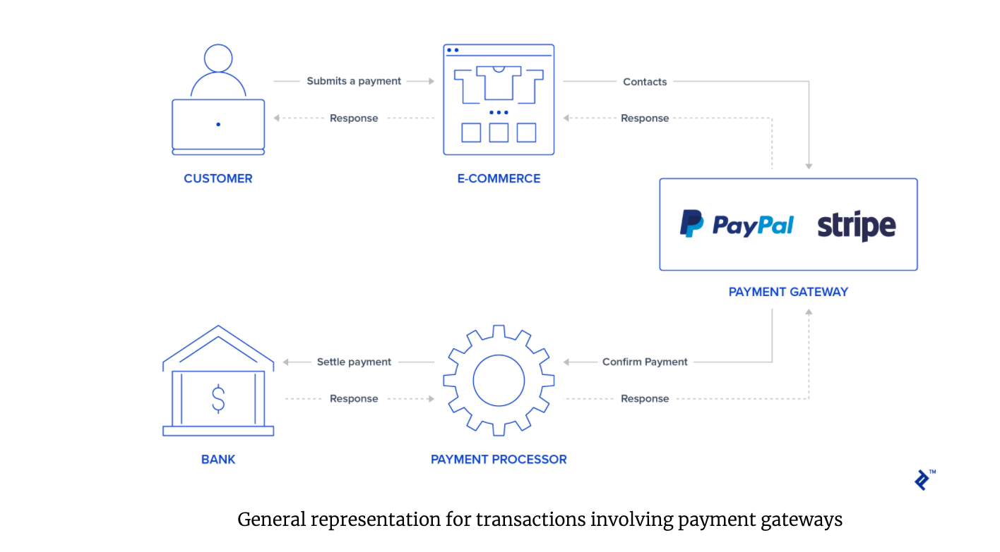

# Stripe 

## Overview and Origin

* Stripe was founded in 2010 by John and Patrick Collison.

* The idea for Stripe, an online payment solution, stemmed from the difficulties users were confronted with while making transactions on the web. 

* Stripe's valuation is $95 billion. Since 2011, the company has received funding by a multitude of investors and banks. In its latest round of funding, the fintech company received $600 million. Primary investors include Allianz Group, Axa SA, Fidelity Management & Research, and Ireland's National Treasury Management Agency.  

## Business Activities 

* Stripe is trying to enable a smooth user experience for accepting payments on the web. Previous to Stripe, it was very difficult for vendors to accept payments due to the outdated financial technology stacks that were required to for the process. From banks to credit card companies to finally the end user, the integration of APIs in online transactions was less user friendly. Now that Stripe has arrived, web entrepreneurs and users alike can partake in the e-commerce experience with feasibility. 

* Stripe is a company that has a business model agile enough to serve a wide variety of clientele. From corporations to nonprofits, Stripe's payment integration solution has helped their customers expand their e-commerce goals. Any person, company or organization can use Stripe to manage their online retail activities. 

    - The company has a market share of 13.19% in the payment management market. 

    - Unlike PayPal which offers service plans, a process in which customers may be redirected to the PayPal app, Stripe's payment process remains the same regardless of which other features you choose to use. 

    - Stripe is considered to be a developer friendly payment management company. It offers a powerful suite of developer tools for integrating Stripe's payment features into an e-commerce site.

* Stripe employs a vast array of cutting-edge technologies to maintain an edge in the fintech landscape. Like several digital companies, Stripe uses AWS to dynamically scale their fleet of servers in real-time. In addition, Machine Learning plays a crucial role to Stripe's operational strategy. Both Radar and Billing are applications within Stripe that use ML to block fraud and retry failed charges.  

## Landscape:

* Stripe is currently a disruptor of the Payment Processing industry. Since 2010, the company has helped web entrepreneurs efficiently manage their customers transactions by enabling a smoother experience for end users.   

* Previous to Stripe, PayPal had ruled the payment processing domain as their payment solution was the leading product for online retailers. Moreover, Square disrupted the payment processing industry as the company empowered small businesses to utilize its innovative products such as its chip reader. Thanks to Square, local restaurants were able to become more mobile while efficiently managing customer payments. However, with the advent of Stripe, developers are now empowered to customize their payment solution to their business strategy/model. 

* Aside from PayPal and Square, some other notable companies include Due which offers an end-to-end service that includes the entire billing and payment process for vendors as well as Payline, one of the most well-reviewed payment processors currently available.  

## Results
* According to an IDC White Paper, Stripe has added substantial value to its customers. On average, organizations using Stripe attributed a revenue increase of almost 7% to the Stripe Platform. More generally, Stripe has been able to cut its clients processing costs through its developer suite, API, and fraud prevention tools. Stripe has been a dependable asset as the pace of innovation within the digital economy has become more rapid. 

* The metrics used for evaluating success in the payment processing industry for online retailers comes down to the end user. To meet this demand, Stripe's APIs help companies build intuitive checkout interfaces for both desktop and mobile payments. In addition, curbing fraud in this arena is crucial to building a strong corporate reputation amongst partners and competitors alike. Stripe Radar, a security application, accurately reduces fraudulent activity with its machine learning algorithms. In summary, product usability and IT security are crucial variables in achieving success within the realm of online retail payments. 

* In comparison to companies such as Square and PayPal, Stripe has held its own in the payment processing space. Although PayPal can be considered the first viable disruptor of this arena, Stripe has been able to ensure a competitive advantage in making its platform user-friendly and secure. The one thing that Stripe lacks is an in-person payment solution that both PayPal and Square currently possess. Square holds the edge in this area as its user friendly in-person payment solution has disrupted the small business economy. Although security will always be a critical variable to consider in this space, outsourcing should also be considered.

## Recommendations 
* A suggestion for Stripe would be that the company build out a Digital Wallet segment. This would allow street vendors to make secure transactions from their mobile device. Stripe possesses a competitive advantage in the payment processing sphere, which enables the company to be an integral component of online retail. However, Stripe could expand its clientele to local businesses as well as regions and countries that depend on informal economies.  

* From budgeting to making online donations, Stripe could introduce the digital wallet product as a solution to the casual online user. This would further enable the company to build its strong API solution. The mining of new user data from its digital wallet solution could help to facilitate strategy for its payment processing business. 

* Due to the fact that digital wallets and payment processing technology is quite similar, Stripe would not need to fully innovate a new technology to build out this segment. Furthermore, Stripe has been celebrated for its user friendly interface, so applying its usability to a digital wallet product would add to this advantage. Application security must also be a critical component to a digital wallet. Cybersecurity is the most important aspect to the e-commerce world.  

* A friendly application interface as well as cybersecurity are very necessary to the stability of a digital wallet product. Both elements enable a technology company to craft a reputation that can be a selling point to businesses and users alike. 
Why are these technologies appropriate for your solution?

https://www.fundera.com/blog/stripe-competitors

https://www.economist.com/finance-and-economics/2021/03/20/america-used-to-be-behind-on-digital-payments-not-any-more

https://www.merchantmaverick.com/paypal-vs-stripe/

https://stripe.com/en-br/guides/managing-credit-risk